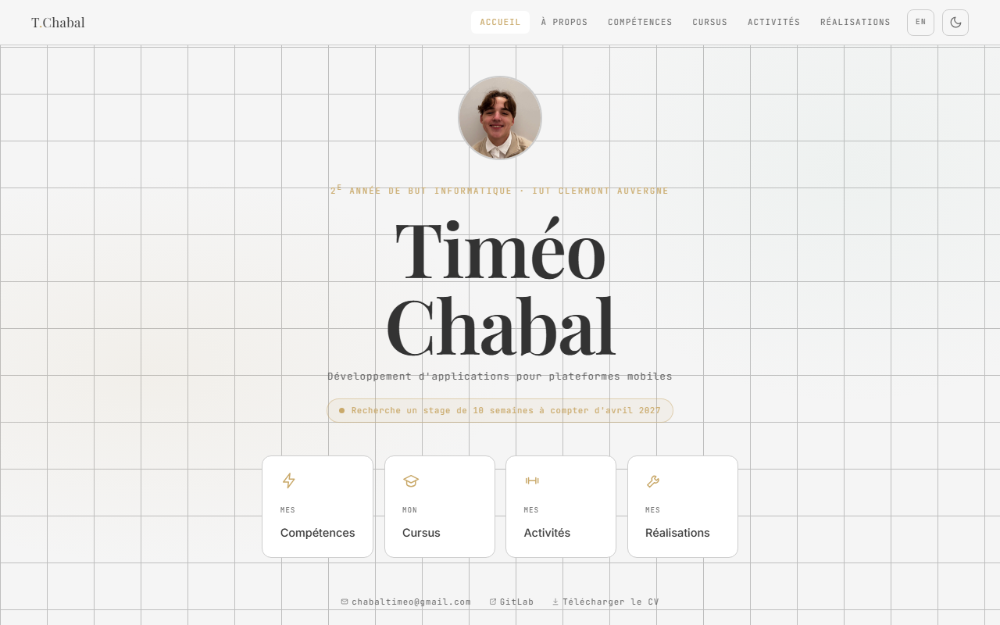

# Portfolio de Timéo Chabal

Portfolio personnel écrit et déployé à la main, sans framework ni générateur de site statique.
Réalisé dans le cadre du BUT Informatique à l'IUT Clermont Auvergne.

**➜ [Voir le site en ligne](https://pumcak.github.io/portfolio/)**



<p>
  
  
  
  
  
</p>

## Le projet

Le site présente mon parcours, mes compétences et les projets réalisés pendant le BUT : SAÉ 1.02
(outil de gestion de stock en C), SAÉ 2.01 (jeu Onitama en C# / .NET MAUI) et un bot Discord de
modération développé en autonomie.

Le parti pris technique était d'écrire le site intégralement à la main, sans framework CSS ni
bundler, pour maîtriser le HTML, le CSS et le JavaScript produits plutôt que de les déléguer à un
outil.

## Ce qu'il contient

- **Bilingue FR / EN** : version anglaise complète dans `en/`, bascule de langue page à page
- **Thème clair / sombre** : bascule manuelle, préférence mémorisée en `localStorage`
- **Responsive** : mise en page fluide du mobile au grand écran
- **Accessibilité** : palette choisie pour respecter le contraste AA, navigation au clavier,
  attributs `alt` et repères ARIA sur la navigation
- **Aucune dépendance** : ni npm ni build, les fichiers servis sont les fichiers écrits

## Structure

```text
index.html            Accueil
apropos.html          Présentation
competences.html      Compétences techniques (acquis / en cours)
cursus.html           Parcours de formation
hobbies.html          Activités extra-scolaires
realisations.html     Vue d'ensemble des projets
sae.html              Liste des SAÉ
sae-1.html            SAÉ 1.02, gestion de stock en C
sae-2.html            SAÉ 2.01, Onitama en C# / .NET MAUI
perso.html            Bot Discord de modération
en/                   Version anglaise complète
theme.css / theme.js  Feuille de style et script partagés (thème, navigation)
images/               Visuels, captures de projets et CV
docker/               Image Docker de déploiement (PHP 8 / Apache)
```

## Lancer le site en local

Aucune installation n'est nécessaire, n'importe quel serveur statique suffit :

```bash
python -m http.server 8000
```

Puis ouvrir <http://localhost:8000>.

Ou via Docker, avec la même image que celle utilisée en production :

```bash
docker build -f docker/Dockerfile -t portfolio .
docker run --rm -p 8080:80 portfolio
```

## Déploiement

Le dépôt d'origine est hébergé sur le GitLab de l'IUT (CodeFirst). À chaque push sur `main`, la
CI construit l'image Docker définie dans `docker/Dockerfile`, la pousse sur le registre de l'IUT
et la déploie sur le cluster Kubernetes de l'école, avec une analyse SonarQube en parallèle
(`.gitlab-ci.yml`).

Ce dépôt GitHub est un miroir public, servi par GitHub Pages.

## Contact

Étudiant en 2ᵉ année de BUT Informatique, parcours développement d'applications pour plateformes
mobiles. **Je recherche un stage de 10 semaines à compter d'avril 2027** en Auvergne-Rhône-Alpes.

[chabaltimeo@gmail.com](mailto:chabaltimeo@gmail.com)
